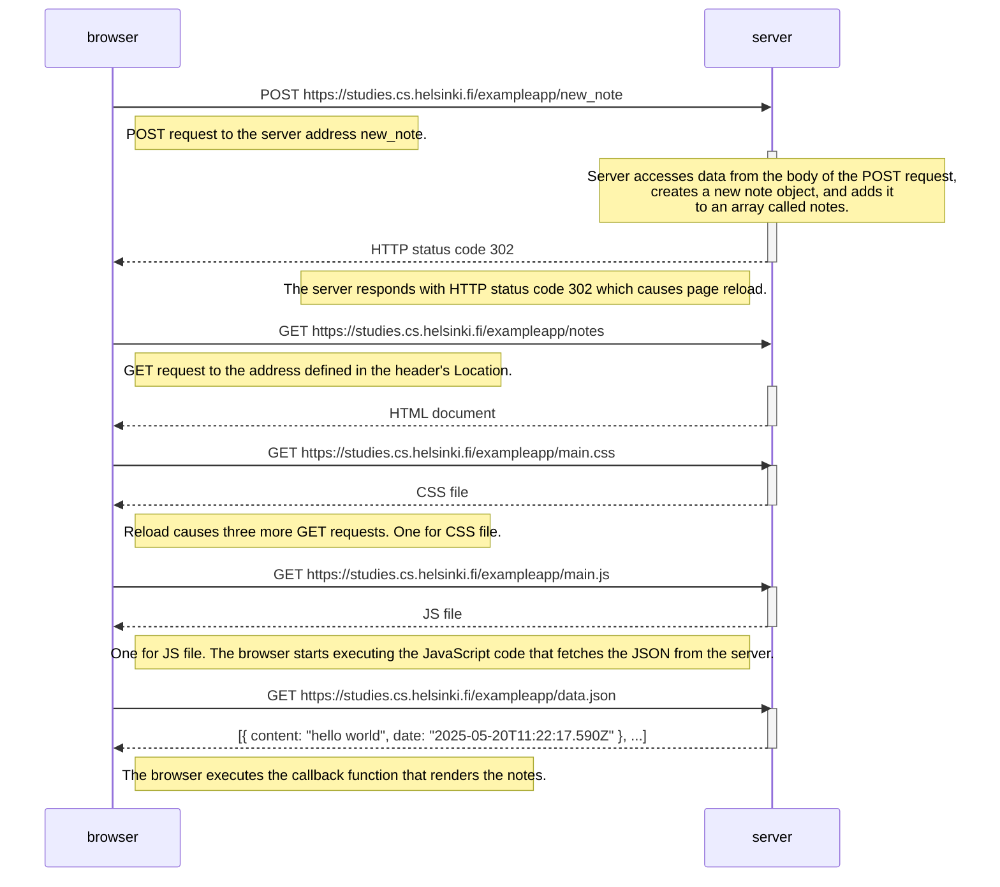

```mermaid
sequenceDiagram
  participant browser
  participant server

    browser->>server: POST  https://studies.cs.helsinki.fi/exampleapp/new_note
    Note right of browser: POST request to the server address new_note. 
    activate server
    Note over server: Server accesses data from the body of the POST request, <br> creates a new note object, and adds it <br> to an array called notes.
    server-->>browser: HTTP status code 302
    deactivate server
     Note left of server: The server responds with HTTP status code 302 which causes page reload.

    browser->>server: GET https://studies.cs.helsinki.fi/exampleapp/notes
    Note right of browser: GET request to the address defined in the header's Location.
    activate server
    server-->>browser: HTML document
    deactivate server
    

    browser->>server: GET https://studies.cs.helsinki.fi/exampleapp/main.css
    activate server
    server-->>browser: CSS file
    deactivate server

    Note right of browser: Reload causes three more GET requests. One for CSS file.

    browser->>server: GET https://studies.cs.helsinki.fi/exampleapp/main.js
    activate server
    server-->>browser: JS file
    deactivate server

    Note right of browser: One for JS file. The browser starts executing the JavaScript code that fetches the JSON from the server.

    browser->>server: GET https://studies.cs.helsinki.fi/exampleapp/data.json
    activate server
    server-->>browser: [{ content: "hello world", date: "2025-05-20T11:22:17.590Z" }, ...]
    deactivate server

    Note right of browser: The browser executes the callback function that renders the notes.
```
