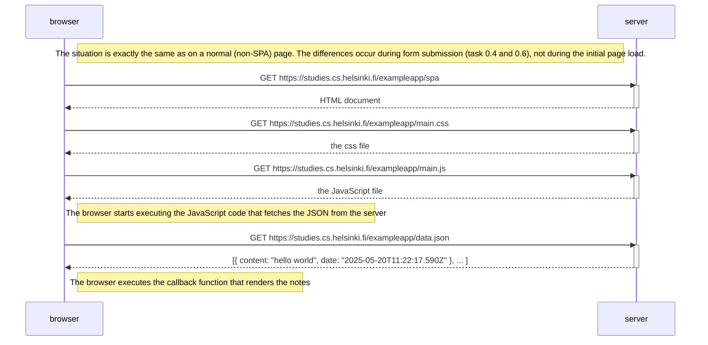

```mermaid
sequenceDiagram
    participant browser
    participant server

    Note right of browser: The situation is exactly the same as on a normal (non-SPA) page. The differences occur during form submission (task 0.4 and 0.6), not during the initial page load.
    browser->>server: GET https://studies.cs.helsinki.fi/exampleapp/spa
    activate server
    server-->>browser: HTML document
    deactivate server

    browser->>server: GET https://studies.cs.helsinki.fi/exampleapp/main.css
    activate server
    server-->>browser: the css file
    deactivate server

    browser->>server: GET https://studies.cs.helsinki.fi/exampleapp/main.js
    activate server
    server-->>browser: the JavaScript file
    deactivate server

    Note right of browser: The browser starts executing the JavaScript code that fetches the JSON from the server

    browser->>server: GET https://studies.cs.helsinki.fi/exampleapp/data.json
    activate server
    server-->>browser: [{ content: "hello world", date: "2025-05-20T11:22:17.590Z" }, ... ]
    deactivate server

    Note right of browser: The browser executes the callback function that renders the notes
```
