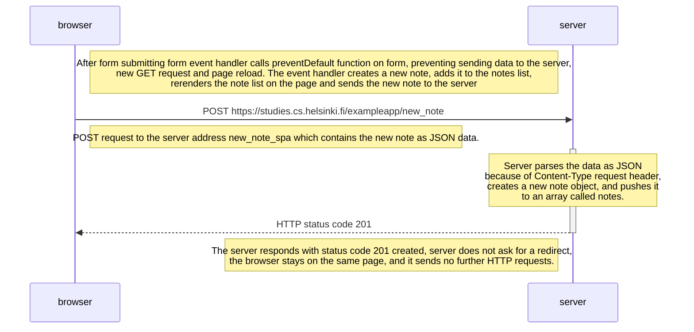

```mermaid
sequenceDiagram
  participant browser
  participant server

    Note right of browser: After form submitting form event handler calls preventDefault function on form, preventing sending data to the server, <br> new GET request and page reload. The event handler creates a new note, adds it to the notes list, <br> rerenders the note list on the page and sends the new note to the server

    browser->>server: POST  https://studies.cs.helsinki.fi/exampleapp/new_note
    Note right of browser: POST request to the server address new_note_spa which contains the new note as JSON data.
    activate server
    Note over server: Server parses the data as JSON <br> because of Content-Type request header, <br> creates a new note object, and pushes it <br> to an array called notes.
    server-->>browser: HTTP status code 201
    deactivate server
    Note left of server: The server responds with status code 201 created, server does not ask for a redirect, <br> the browser stays on the same page, and it sends no further HTTP requests.
```
